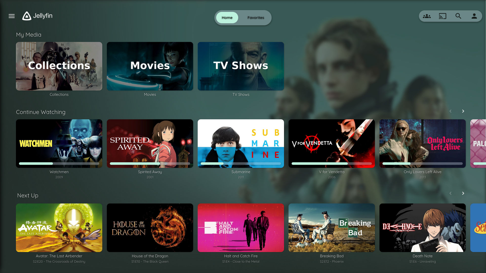

# 🎬 Ushiflix

> Une expérience de streaming élégante et soignée

## 📖 À propos

Une plateforme de streaming personnelle qui privilégie l'expérience utilisateur et la qualité visuelle. Interface moderne inspirée des meilleures pratiques de design, pensée pour le plaisir de découvrir et redécouvrir ses contenus favoris.

## ✨ Expérience

### 🎨 Interface soignée
- **Design épuré** : Thème personnalisé pour une navigation fluide
- **Responsive** : Parfaitement adapté à tous les écrans
- **Animations subtiles** : Transitions élégantes et cohérentes
- **Mode sombre** : Confort visuel en toutes circonstances

### 🎭 Découverte intuitive
- Navigation par genres et collections
- Suggestions personnalisées
- Système de favoris et watchlist
- Recherche avancée avec filtres

### 📱 Partout avec vous
- Interface web moderne
- Applications mobiles natives
- Streaming vers TV (Chromecast/AirPlay)
- Synchronisation entre appareils

## 🖼️ Aperçu

### Accueil

*Vue d'ensemble avec collections organisées et suggestions personnalisées*

### Catalogue

*Parcours fluide du catalogue avec filtres et tri personnalisé*

### Lecture

*Expérience de visionnage immersive avec contrôles intuitifs*

### Détails

*Informations complètes et présentation soignée du contenu*

## 🎯 Collections

### 🎬 Cinéma
- **Classiques** : Chefs-d'œuvre intemporels et films cultes
- **Contemporain** : Productions récentes et blockbusters
- **Auteur** : Cinéma d'art et réalisateurs reconnus
- **Animation** : Studio Ghibli, Disney, et animation mondiale

### 📺 Séries
- **Incontournables** : Breaking Bad, Avatar, The Sopranos
- **Récentes** : Productions originales et séries actuelles
- **Animation** : Anime et séries d'animation de qualité
- **Documentaires** : Contenus éducatifs et reportages

### 🎵 Bonus *(bientôt)*
- Concerts et performances live
- Documentaires musicaux
- Clips et vidéos d'artistes

## 🔐 Accès

Cette plateforme fonctionne sur **invitation uniquement** pour préserver la qualité de l'expérience et maintenir une communauté engagée.

### Demander l'accès
Intéressé·e ? Contactez-moi en expliquant :
- Qui vous êtes en quelques mots
- Ce qui vous intéresse dans cette approche
- Votre engagement à respecter l'esprit de partage

*Les places sont limitées pour garantir une expérience optimale à tous.*

## 🤝 Philosophie

### ✅ Dans l'esprit
- Découverte et partage de contenus de qualité
- Respect de la communauté et des ressources
- Curiosité et ouverture culturelle
- Feedback constructif pour améliorer l'expérience

### ❌ Pas dans l'esprit
- Usage commercial ou redistribution
- Consommation excessive sans considération
- Non-respect des autres utilisateurs

## 🔄 Évolution

### Récemment
- **Interface** : Thème personnalisé avec animations fluides
- **Contenu** : Expansion de la collection animation
- **Expérience** : Optimisation de la navigation mobile

### À venir
- [ ] Section dédiée aux documentaires
- [ ] Collections thématiques saisonnières  
- [ ] Mode "soirée cinéma" avec ambiance adaptée
- [ ] Système de recommandations affiné

## 🎨 Design

L'interface s'inspire des meilleures pratiques en matière d'UX/UI, avec un accent sur :

- **Lisibilité** : Typographie claire et hiérarchie visuelle
- **Navigation** : Parcours intuitif et raccourcis intelligents  
- **Esthétique** : Cohérence visuelle et attention aux détails
- **Performance** : Fluidité et temps de réponse optimisés

*Thème basé sur [ZestyTheme](https://github.com/stpnwf/ZestyTheme) avec adaptations personnelles*

## 💬 Contact

Pour toute demande d'accès ou question :

📧 **Email** : [contact]  
🌐 **Web** : [portfolio]

---

> *Une approche personnelle du streaming, entre technologie et émotion visuelle*

**Créé avec soin 🎬**
